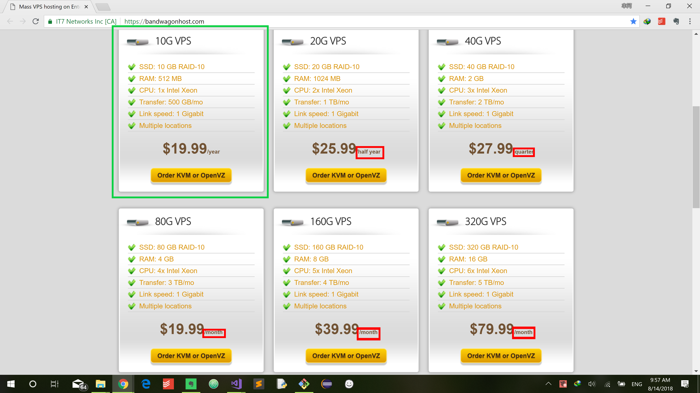
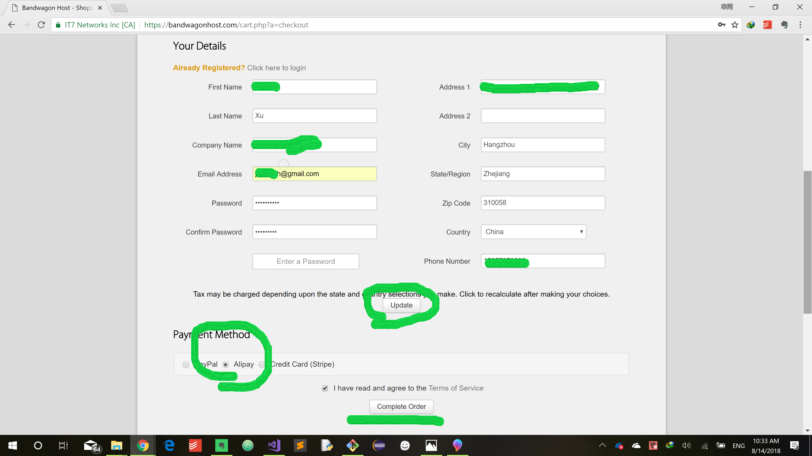
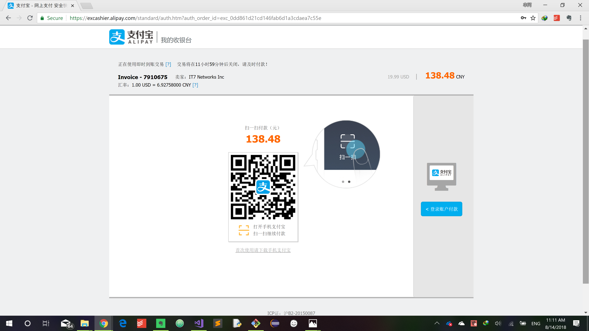
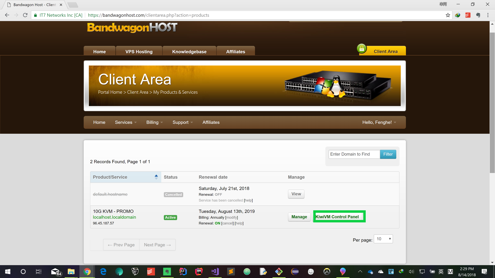
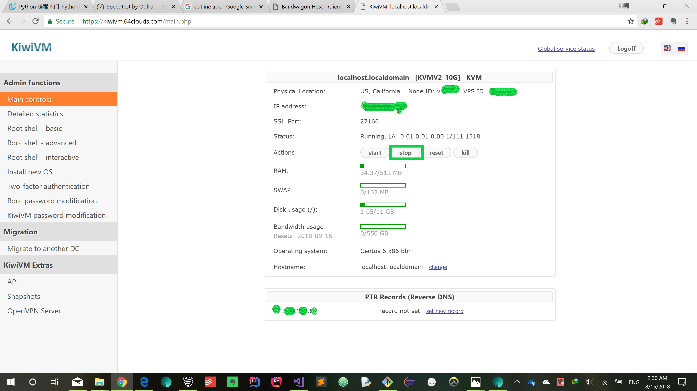
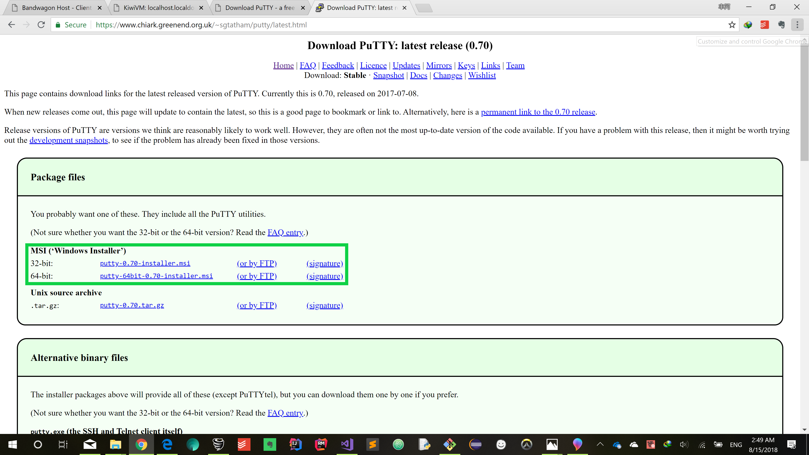
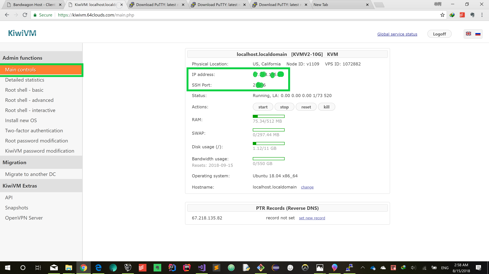
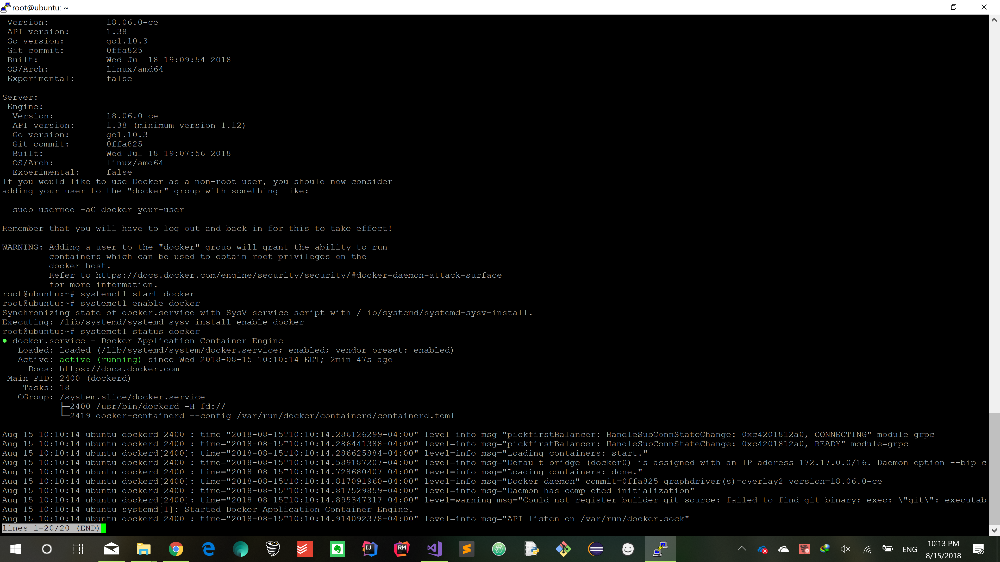
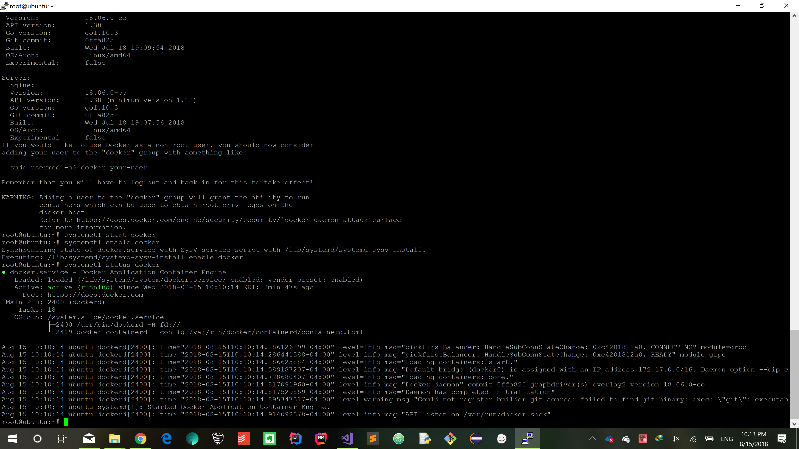
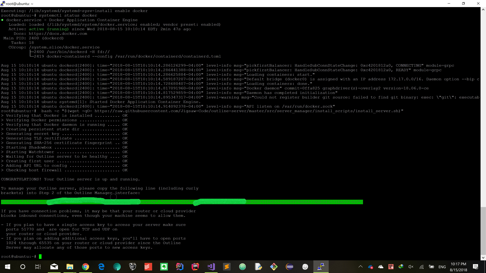

# Step by Step Tutorial
## Part A: Purchase a server from BandwagonHost
  **1. Open the [official website of BandwagonHost](https://bwh1.net/) in your web brouser**  
  *(Tips: you may have no access to https://bandwagonhost.com/, just try https://bwh1.net/ out.)*    
     

  **2. Select your preferred VPS([Virtual Private Server](https://en.wikipedia.org/wiki/Virtual_private_server)) option. Here we choose the first option(10G VPS), which I highly recommend**   
  *(Cautious: Some of these options are charged by quater or month instead of year, so pay attention if you'd like to select one of the rest.)*   
     

  **3. Click on [Order KVM or OpenVZ](https://bwh1.net/vps-hosting.php)**  
     

  **4. Click on the *Order [KVM](https://www.linux-kvm.org/page/Main_Page)* option in the first column of the table.**  *(Our Outline server will be on an Ubuntu distribution of Linux)*
     
 
  **5. Click on *Add To Cart***
      

  **6. Click on *Checkout***
     

  **7. Assuming you're not registered yet, fill in the forms to create an account and choose your payment method** *(Alipay is recommended for Chinese users)*
      

  **8. Click on *Pay Now***
    

  **9. Scan the Alipay QR payment code and finish your payment on your mobile phone or directly on your PC**
  
#### *After the payment, you are now ready to set up the server.*

## Part B: Set Up an Outline Server on your VPS   
  *After the payment, you should now be able to access the server you have just purchased.*  
  *Please follow the following steps to step up your server.* 
   
 **1.Log into your account**   
 *Click on the *Client Area* button on the upper right corner of the official website.*
  
 * *Log in with your email address and password that have been previously registered for your account in [<u>part A, step 7</u>](#register) of this tutorial.*  
 *Click on the Login button after you have filled in the forms.*
    

  **2. Install the right Operating System on your server**  
  *Click on **Services** then **My Services***  
  
  *Click on **KiwiVM Control Panel***
  
  *Stop the server before **Reload**: Click on **Stop***  
  
  *Click on **Install New OS***
  
   
  **3. Install new OS**  
  *Select **Ubuntu-18.04-x86_64**, which is at the bottom of the selection box. Then **check the agreement box** and finally left click **Reload**.*  
  
  *You should see something like below a few seconds later. The password and SSH port are important, so you may copy it or take a screenshot for later utility. (This information is also sent to you by email, but may take a while, so keep it yourself just in case)*  
  

  **4. Install PuTTy**  
  *[Click here](https://www.chiark.greenend.org.uk/~sgtatham/putty/latest.html) to go to the PuTTy download page. Download the 32-bit or 64-bit version(mostly 64-bit) version of PuTTy and install it.*  
  *After a quick installation, you are now ready to use the PuTTy to connect to the server.*
  

  **5. Login to the server with PuTTy**  
  *Go Back to **Main controls** and look up the IP address and SSH Port. *
  
  *Run PuTTy.exe on your PC, then enter the IP address and Port according to the **Main controls** Panel*
  *  (Note: 1. When you input your password, it is not shown explicitly, but recorded internally. So just **hit the Enter key** when you're ready to login. 2. **Ctrl+V** (**Shift+Insert** instead) for paste, **Ctrl+C** (**Ctrl+Insert** instead) for copy are **NOT supported** in shell.)*  

  *Login with the following customized information:*  
  `log in as: root`  
  `root@xxx.xxx.xxx.xxx's password: (The one you copied or in the screenshot or you can find it in your mail box.)`  

    

  
  *Click on yes in the Alert Window and you are now ready to configure the server remotely and you should see:*  
  
  *(A successful login looks like this)*

  **6. Configure the environment**  
  *It is time for us to copy and paste code! Interactive shell reacts responsively whenever we input a single line of code and hit the Enter key on our keyboard.
   So what you need to do is to enter the following code line by line and check if each one of these lines work similar to my description.*
  1. `sudo -i`   
  *You should get a new line as a response. Just continue to enter line 2.*
  2. `sudo apt-get install curl`   
  *After hitting the Enter key and wait for a few seconds, you should see a prompt. Enter y and the installation should continue.*  
  
  *Go to **[Line 3](#code-line-3)** when you see this:*
  
  3. <a id="code-line-3"/>`curl -sS https://get.docker.com/ | sh`  
  *It may take quite a few minutes until you see something like this:*
   
  4. `systemctl start docker`  
  *The same response as the 1st line.*
  5. `systemctl enable docker`  
  
  6. `systemctl status docker`  
  *If you see the green"active running", you are safe to continue.*
  
  *Hit Q key directly*
   
  
  **7. Set up the *Outline server***  
  Enter the following line of code in the shell.  
  `bash -c "$(wget -qO- https://raw.githubusercontent.com/Jigsaw-Code/outline-server/master/src/server_manager/install_scripts/install_server.sh)"`
  
  *Select the green line(in the above picture) with your mouse cursor and the line is automatically copied to your paste board. Just paste, save and keep it in a .txt file for later use.*  
    
#### *Congratulations! Up until now, you have set up the server side of your VPN.*

## Part C: Connect to the server from multiple platforms
  
  **1. Install the *Outline Manager* on your PC**  
  *Download the **Outline Manager**(It is Open Source) in the repository at the top of this web page.*

Temporary develop note:

change the selection to 30 dollar one or change server with the 20 dollar one

outline client download:
https://github.com/Jigsaw-Code/outline-client/releases

The link should work for all phones